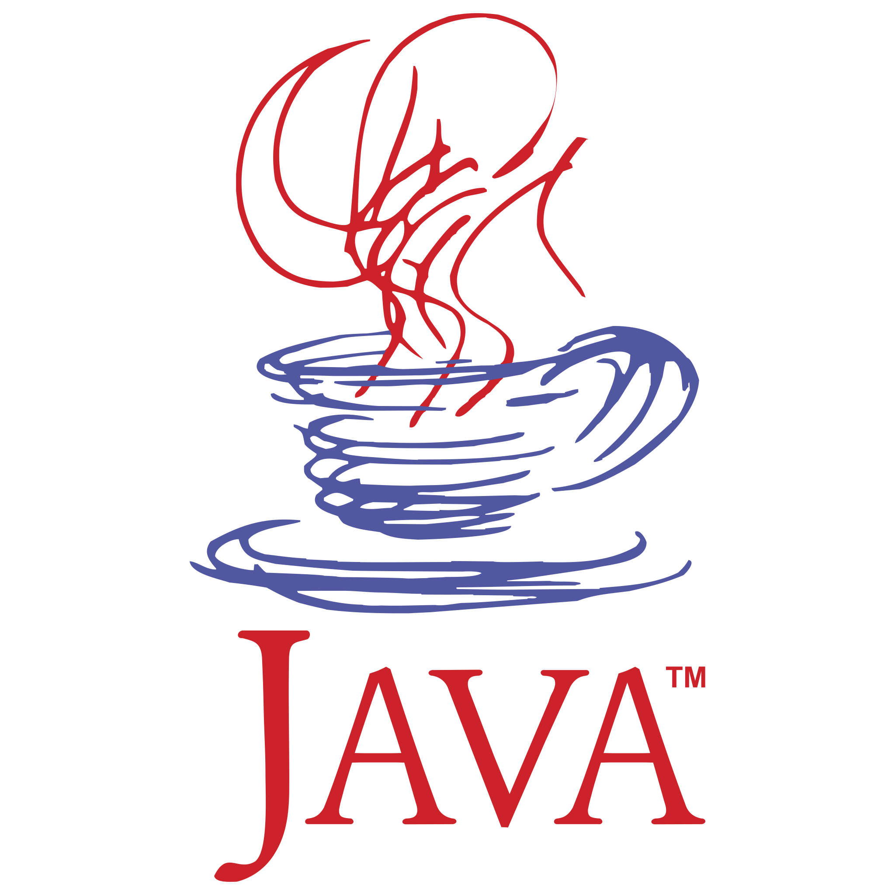

<h1 align="center">Hi, everyone! My name is <a href="https://www.linkedin.com/in/andrii-yukhymenko/" target="_blank">Andrii Yukhymenko</a> 👋</h1>
<h3 align="center">I am beginner full-stack developer</h3>

Here are some ideas to get you started:

- 🔭 I’m currently working on the <h6> finance accounting system for the currency exchange chain <h6>
- 🌱 I’m currently learning **Java, Typescript, HTML, CSS**
- 📫 How to reach me: **yuhim.andrey@gmail.com**
- 🌍 I speak Ukrainian (native), Russian (sesond), English (A2), German (A1)

### Connect with me:

## 💻 Tech Stack:

### Languages:

 
 

### Frameworks / Preprocessors / Libraries:

### Tools:

 
 
 
 
 
 

## Isometric commit calendar

## GitHub Statistic

 &nbsp; &nbsp; 

